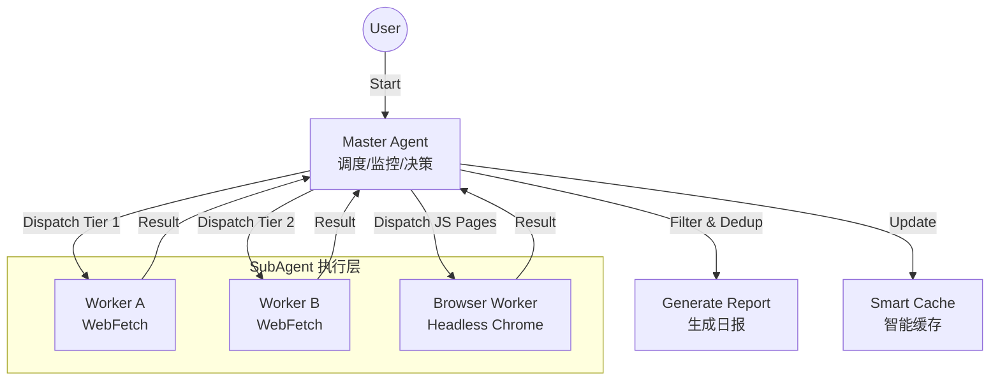

# Erduo Skills / 耳朵技能库

[English](README_EN.md)

> 为 AI Agent 赋能，提供结构化能力与智能工作流。

## 📖 简介

**Erduo Skills** 是一个专门用于管理 AI Agent 智能技能的仓库。它作为一个知识库和执行框架，使 Agent 能够执行自动新闻报道、数据分析等复杂任务。

---

## ✨ 精选技能：每日日报

**每日日报** 是一个高级技能，旨在自动从多个来源抓取、筛选并总结高质量的技术新闻。

### 🏗 核心架构

该技能采用 **Master-Worker** 架构，包含智能调度器和专用子 Agent。



### 🚀 核心特性

- **多源抓取**:
  - 聚合 HackerNews, HuggingFace Papers 等优质源。
  
- **智能筛选**:
  - 筛选高质量技术内容，排除营销软文。
  
- **动态调度**:
  - 采用“早停机制”：一旦抓取到足够的高质量条目（如 20 条），即停止抓取以节省资源。

- **无头浏览器支持**:
  - 使用 MCP Chrome DevTools 处理复杂的 JS 渲染页面（如 ProductHunt）。

### 📄 输出示例

日报以结构化 Markdown 格式生成，存储在 `NewsReport/` 目录下。

> **Daily News Report (2024-03-21)**
>
> **1. 文章标题**
> - **摘要**: 文章内容的简要总结...
> - **要点**: 
>   1. 要点一
>   2. 要点二
> - **来源**: [链接](...) 
> - **评分**: ⭐⭐⭐⭐⭐

---

## ✨ 技能：Gemini 水印移除

**Gemini Watermark Remover** 是一个利用逆向 Alpha 混合技术去除 Gemini 生成图片水印的工具。适用于需要批量处理 Gemini 图片或集成去水印功能的场景。

### 🚀 核心特性

- **精准去水印**:
  - 针对 Gemini 图片右下角水印进行像素级还原。
  - 使用预制 Alpha 遮罩（48px/96px）确保高质量去除。
  
- **纯 Python 实现**:
  - 核心算法仅依赖 Pillow，轻量且易于修改。
  - 提供 CLI 命令行工具，方便集成到工作流中。

### 📄 效果

- 如果你需要调整检测规则，可以参考 `skills/gemini-watermark-remover/references/algorithm.md`。

---

## 📂 项目结构

```bash
├── .claude/
│   └── agents/       # Agent 定义 (Personas & Prompts)
├── skills/           # 技能实现 (例如 daily-news-report)
│   └── daily-news-report/  # 每日日报技能
├── NewsReport/       # 生成的日报存档
├── README.md         # 项目文档 (默认为中文)
└── README_EN.md      # 英文项目文档
```

## 🛠 使用方法

1.  **克隆仓库**
    ```bash
    git clone https://github.com/Start-to-DJ/erduo-skills.git
    cd erduo-skills
    ```

2.  **使用 Agent 运行**
    将此仓库加载到您的 Agent 环境中（例如 Claude Desktop 或支持 MCP 的 Zed）。Agent 将自动识别 `daily-news-report` 技能。

    *提示词示例:*
    > “生成今天的日报。”

## 🤝 贡献指南

欢迎贡献！如果您有新的技能想法，请参考 `.claude/skills` 目录下的示例。

---

*Created with ❤️ by Erduo Team*
