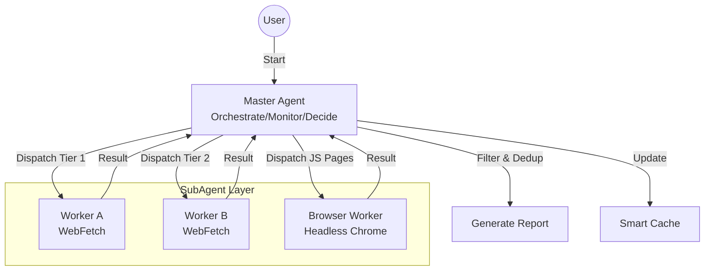

# Erduo Skills

[中文](README.md)

> Empowering AI Agents with structured capabilities and intelligent workflows.

## 📖 Overview

**Erduo Skills** is a specialized repository designed to house and manage intelligent skills for AI agents. It serves as a knowledge base and execution framework, enabling agents to perform complex tasks such as autonomous news reporting, data analysis, and more.

---

## ✨ Featured Skill: Daily News Report

The **Daily News Report** is a sophisticated skill designed to autonomously fetch, filter, and summarize high-quality technical news from multiple sources.

### 🏗 Architecture

This skill utilizes a **Master-Worker** architecture with a smart orchestrator and specialized sub-agents.



### 🚀 Key Features

- **Multi-Source Fetching**:
  - Aggregates content from HackerNews, HuggingFace Papers, etc.
  
- **Smart Filtering**:
  - Filters for high-quality technical content, excluding marketing fluff.
  
- **Dynamic Scheduling**:
  - Uses an "Early Stopping" mechanism: if enough high-quality items are found (e.g., 20 items), it stops fetching to save resources.

- **Headless Browser Support**:
  - Handles complex, JS-rendered pages (e.g., ProductHunt) using MCP Chrome DevTools.

### 📄 Output Example

Reports are generated in structured Markdown format, stored in the `NewsReport/` directory.

> **Daily News Report (2024-03-21)**
>
> **1. Title of the Article**
> - **Summary**: A concise summary of the article...
> - **Key Points**: 
>   1. Point one
>   2. Point two
> - **Source**: [Link](...) 
> - **Rating**: ⭐⭐⭐⭐⭐

---

## ✨ Skill: Gemini Watermark Remover

**Gemini Watermark Remover** is a utility that removes the visible Gemini AI watermark from images using reverse alpha blending. Ideal for batch processing or integrating watermark removal into pipelines.

### 🚀 Key Features

- **Precise Removal**:
  - Pixel-perfect restoration for the bottom-right Gemini watermark.
  - Uses pre-captured Alpha masks (48px/96px) for high-quality results.
  
- **Pure Python**:
  - Core algorithm only depends on Pillow; lightweight and easy to modify.
  - Includes a CLI tool for easy integration.

### 📄 Documentation

- For algorithm details and detection rules, see `skills/gemini-watermark-remover/references/algorithm.md`.

---

## 📂 Project Structure

```bash
├── .claude/
│   └── agents/       # Agent personas & prompts
├── skills/           # Executable skill definitions
│   └── daily-news-report/  # The Daily News Report skill
├── NewsReport/       # Generated daily reports
├── README.md         # Project documentation (Chinese by default)
└── README_EN.md      # Project documentation (English)
```

## 🛠 Usage

1.  **Clone the repository**
    ```bash
    git clone https://github.com/Start-to-DJ/erduo-skills.git
    cd erduo-skills
    ```

2.  **Run with Agent**
    Load this repository into your Agent environment (e.g., Claude Desktop, Zed with MCP). The Agent will automatically recognize the `daily-news-report` skill.

    *Prompt Example:*
    > "Generate today's news report."

## 🤝 Contributing

Contributions are welcome! If you have a new skill idea, please check the `.claude/skills` directory for examples.

---

*Created with ❤️ by Erduo Team*
